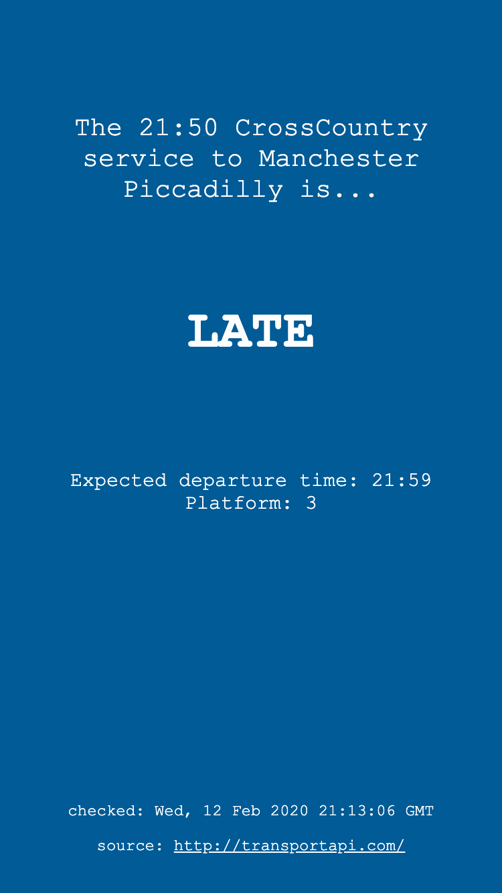

# [is-my-train-running](https://check-my-train.netlify.com/)

A node.js based static site generator which queries
[transportapi](https://www.transportapi.com/) for my morning train and builds a
static page to display the status of my train; on time, late or
cancelled.

Registers a service worker when the page is opened, this allows the page to be added to the home screen on mobile devices.

Uses [netlify](https://www.netlify.com/) for building and hosting the site and
[zapier](https://zapier.com) to trigger builds at specified times.

Builds are set to trigger at 7:25, 7:30 & 7:35.

## Build instructions

- Clone repo
- Install dependencies with `npm/yarn install`
- Run `npm/yarn dev` to compile assets and start a development server
- Run `npm/yarn build` to compile the assets for production in the public directory

## Screenshots

### On time

### Late

### Cancelled

