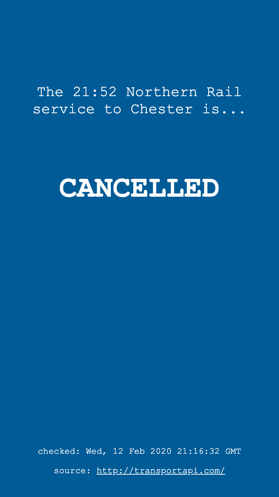

# is-my-train-running

A node.js based static site generator which queries
[transportapi](https://www.transportapi.com/) for my morning train and builds a
static page to display the status of my train; on time, late or
cancelled.

Uses [netlify](https://www.netlify.com/) for building and hosting the site and
[zapier](https://zapier.com) to trigger builds at specified times.

Builds are currently set to trigger at 7:25, 7:30 & 7:35.

## Screenshots

### On time

### Cancelled

